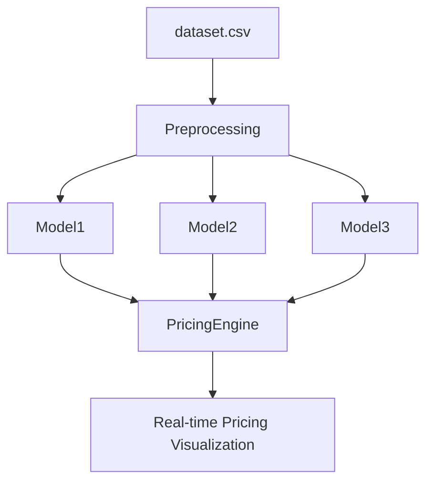

# 🚗 Dynamic Pricing for Urban Parking Lots

## 📌 Overview
This project implements a dynamic pricing engine for 14 urban parking lots using real-time data collected over 73 days. Prices are dynamically updated based on occupancy, queue length, traffic, vehicle type, and competitor pricing. This simulation is part of Summer Analytics 2025 hosted by Consulting & Analytics Club × Pathway.

## 🧰 Tech Stack
- Python 3.10
- Pandas
- Numpy
- Bokeh (for real-time visualization)
- Google Colab
- Pathway (for real-time simulation capability)

## 🧱 Architecture Diagram

## ⚙️ Workflow
1. Load and parse timestamped parking lot dataset
2. Feature engineering for queue, occupancy, traffic, and vehicle type
3. Run three pricing models:
   - **Model 1**: Linear baseline pricing
   - **Model 2**: Demand-based pricing using a custom formula
   - **Model 3**: Competitive pricing based on nearby lots
4. Visualize real-time price predictions using Bokeh
5. Simulate real-time streaming behavior via batch updates

## 📁 Repository Contents
- `Dynamic_Pricing_Final_Capstone_Colab.ipynb`: Main notebook
- `dataset.csv`: Dataset file (provided separately)
- `Dynamic_Pricing_Model_Explanation.pdf`: PDF explanation of models
- `README.md`: This file
- `requirements.txt`: Required packages

## 📄 Notes
- All models are implemented from scratch (no scikit-learn, no XGBoost)
- Bokeh is used for simulating real-time visual updates
- The notebook is ready to run in Google Colab
